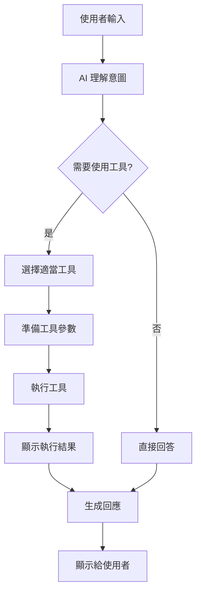

# AI Agent 對話功能設計文件

## 概述
AI Agent 是一個整合在白板應用右側側邊欄的智能助手，能夠理解白板內容、回答問題，並透過工具系統直接操作白板元素。

## 核心功能

### 1. 對話介面
- **位置**：右側側邊欄（SidePanel）
- **介面元素**：
  - 對話歷史區域（可滾動）
  - 輸入框（支援多行輸入）
  - 發送按鈕
  - 工具執行狀態顯示
  - 清除對話按鈕

### 2. AI 能力

#### 2.1 白板理解
- **初始化摘要**：開啟對話時，自動生成白板內容摘要
- **即時更新**：白板內容變更時，更新 AI 的上下文
- **內容分析**：理解便利貼之間的關係、群組結構、連接邏輯

#### 2.2 問答能力
- 回答關於白板內容的問題
- 提供策略建議（如行銷策略、產品規劃）
- 分析白板結構並給出優化建議

### 3. 工具系統

- StickyNote 物件
  - 需要可以看到 note 的連接關係，關聯 note 的名稱/id 等，有需要時繼續追蹤
  - 還要可以看到所屬 group id 和名稱，有需要時繼續追蹤
- Group 物件
  - 需要可以看到該群組內有哪些 note 和 group，包含 note id/ note name /group id / group name，有需要時繼續追蹤
  - 還要可以看到父 group id 和名稱，有需要時繼續追蹤

- search_notes -> StickNote[]
  - 根據關鍵字匹配便利貼（可多個關鍵字）
- get_note_by_id -> StickNote
  - 根據 id 查詢便利貼
- search_groups -> Group[]
  - 根據關鍵字匹配群組（可多個關鍵字）
- get_group_by_id -> Group
  - 根據 id 查詢群組

#### 3.1 搜尋工具 (SearchTool)
```typescript
interface SearchToolParams {
  keywords: string[];  // 支援 3-4 個關鍵字
  matchType: 'any' | 'all';  // 匹配任一或全部關鍵字
}

interface SearchResult {
  notes: StickyNote[];
  groups: Group[];
  relevanceScore: number;
}
```

**功能**：
- 根據關鍵字搜尋便利貼內容
- 支援模糊匹配
- 返回相關度評分
- 高亮顯示搜尋結果

#### 3.2 獲取詳細資訊工具 (GetDetailsTool)
```typescript
interface GetDetailsParams {
  noteId?: string;
  groupId?: string;
  includeConnections?: boolean;
  includeGroup?: boolean;
  includeContent?: boolean;
}

interface NoteDetails {
  note: StickyNote;
  group?: Group;
  incomingConnections: Array<{
    edge: Edge;
    sourceNote: StickyNote;
  }>;
  outgoingConnections: Array<{
    edge: Edge;
    targetNote: StickyNote;
  }>;
  metadata: {
    connectionCount: number;
    isInGroup: boolean;
    groupName?: string;
  };
}
```

**功能**：
- 根據 ID 查詢特定便利貼或群組
- 獲取便利貼的所有連接關係（傳入和傳出）
- 顯示便利貼所屬群組資訊
- 提供連接數量等元數據

#### 3.3 追蹤連接路徑工具 (TraceConnectionsTool)
```typescript
interface TraceConnectionsParams {
  startNoteId: string;
  direction?: 'forward' | 'backward' | 'both';
  maxDepth?: number;  // 最大追蹤深度，預設 3
  includeContent?: boolean;
  stopAtKeywords?: string[];  // 遇到關鍵字時停止
}

interface ConnectionTrace {
  path: Array<{
    note: StickyNote;
    depth: number;
    edge?: Edge;
  }>;
  endNodes: StickyNote[];
  totalNodes: number;
  branches: Array<{
    fromNoteId: string;
    paths: ConnectionTrace[];
  }>;
}
```

**功能**：
- 從指定便利貼開始追蹤連接路徑
- 支援順向（following）、逆向（backward）或雙向追蹤
- 可設定最大追蹤深度（避免無限循環）
- 支援在遇到特定關鍵字時停止追蹤
- 處理分支路徑（一個便利貼連接到多個便利貼）
- 返回完整的路徑樹狀結構

**使用場景**：
- 追蹤任務流程：從起始任務追蹤到所有後續步驟
- 尋找根因：從問題便利貼逆向追蹤到根本原因
- 影響分析：查看某個變更會影響哪些下游元素

#### 3.4 建立便利貼工具 (CreateNoteTool)
```typescript
interface CreateNoteParams {
  content: string;
  position?: { x: number; y: number };  // 可選，預設自動排版
  color?: string;  // 可選，預設黃色
  groupId?: string;  // 可選，加入特定群組
}
```

**功能**：
- 建立新便利貼
- 自動排版（如未指定位置）
- 支援批量建立

#### 3.5 建立連接工具 (CreateEdgeTool)
```typescript
interface CreateEdgeParams {
  fromNoteId: string;
  toNoteId: string;
  label?: string;  // 可選，連接標籤
}
```

**功能**：
- 建立便利貼之間的連接
- 支援批量連接
- 自動避免重複連接

#### 3.6 群組管理工具 (GroupTool)
```typescript
interface GroupToolParams {
  action: 'create' | 'add' | 'remove';
  noteIds?: string[];
  groupId?: string;
  groupName?: string;
}
```

**功能**：
- 建立新群組
- 將便利貼加入/移出群組
- 重新命名群組

### 4. 工具執行流程



## 資料結構定義

### 核心資料模型

#### StickyNote（便利貼）
```typescript
interface StickyNote {
  id: string;           // 唯一識別碼
  x: number;           // X 座標
  y: number;           // Y 座標
  width: number;       // 寬度
  height: number;      // 高度
  content: string;     // 文字內容
  color: string;       // 背景顏色（hex 格式）
  groupId?: string;    // 所屬群組 ID（選填）
}
```

#### Edge（連接線）
```typescript
interface Edge {
  id: string;          // 唯一識別碼
  from: string;        // 起始便利貼 ID
  to: string;          // 目標便利貼 ID
}
```

#### Group（群組）
```typescript
interface Group {
  id: string;                  // 唯一識別碼
  name: string;                // 群組名稱
  color: string;               // 群組顏色（hex 格式）
  createdAt: Date;             // 建立時間
  noteIds: string[];           // 群組內便利貼的 ID 列表
  imageIds?: string[];         // 群組內圖片的 ID 列表
  parentGroupId?: string;      // 父群組 ID（支援巢狀群組）
  childGroupIds?: string[];    // 子群組 ID 列表
}
```

#### ImageElement（圖片元素）
```typescript
interface ImageElement {
  id: string;                  // 唯一識別碼
  x: number;                   // X 座標
  y: number;                   // Y 座標
  width: number;               // 寬度
  height: number;              // 高度
  url: string;                 // 圖片 URL（base64 或外部連結）
  filename?: string;           // 檔案名稱
  uploadedAt?: Date;           // 上傳時間
  groupId?: string;            // 所屬群組 ID
}
```

#### WhiteboardData（白板完整資料）
```typescript
interface WhiteboardData {
  notes: StickyNote[];         // 所有便利貼
  edges: Edge[];               // 所有連接線
  groups: Group[];             // 所有群組
  images?: ImageElement[];     // 所有圖片
  viewport?: ViewportState;    // 視窗狀態
}

interface ViewportState {
  zoomLevel: number;           // 縮放等級（0.1 到 2.0）
  panOffset: {                 // 平移偏移
    x: number;
    y: number;
  };
}
```

### 資料範例

#### 便利貼資料範例
```json
{
  "id": "note_abc123",
  "x": 250,
  "y": 150,
  "width": 200,
  "height": 100,
  "content": "產品規劃會議\n- 確定 Q1 目標\n- 分配資源",
  "color": "#FFE066",
  "groupId": "group_xyz789"
}
```

#### 連接線資料範例
```json
{
  "id": "edge_def456",
  "from": "note_abc123",
  "to": "note_ghi789"
}
```

#### 群組資料範例
```json
{
  "id": "group_xyz789",
  "name": "Q1 規劃",
  "color": "#4ECDC4",
  "createdAt": "2025-01-17T10:30:00Z",
  "noteIds": ["note_abc123", "note_def456", "note_ghi789"],
  "imageIds": ["img_001"],
  "parentGroupId": "group_parent001",
  "childGroupIds": ["group_child001", "group_child002"]
}
```

#### 完整白板資料範例
```json
{
  "notes": [
    {
      "id": "note_1",
      "x": 100,
      "y": 100,
      "width": 200,
      "height": 100,
      "content": "用戶需求分析",
      "color": "#FFE066",
      "groupId": "group_research"
    },
    {
      "id": "note_2",
      "x": 350,
      "y": 100,
      "width": 200,
      "height": 100,
      "content": "競品分析",
      "color": "#FFE066",
      "groupId": "group_research"
    },
    {
      "id": "note_3",
      "x": 225,
      "y": 250,
      "width": 200,
      "height": 100,
      "content": "產品策略",
      "color": "#95E1D3"
    }
  ],
  "edges": [
    {
      "id": "edge_1",
      "from": "note_1",
      "to": "note_3"
    },
    {
      "id": "edge_2",
      "from": "note_2",
      "to": "note_3"
    }
  ],
  "groups": [
    {
      "id": "group_research",
      "name": "市場研究",
      "color": "#4ECDC4",
      "createdAt": "2025-01-17T09:00:00Z",
      "noteIds": ["note_1", "note_2"],
      "imageIds": []
    }
  ],
  "images": [
    {
      "id": "img_1",
      "x": 600,
      "y": 100,
      "width": 300,
      "height": 200,
      "url": "data:image/png;base64,...",
      "filename": "wireframe.png",
      "uploadedAt": "2025-01-17T10:00:00Z"
    }
  ],
  "viewport": {
    "zoomLevel": 1.0,
    "panOffset": {
      "x": 0,
      "y": 0
    }
  }
}
```

### 資料關係說明

1. **便利貼與群組**：
   - 便利貼透過 `groupId` 屬於某個群組
   - 群組透過 `noteIds` 陣列追蹤其包含的便利貼
   - 一個便利貼只能屬於一個群組

2. **便利貼與連接線**：
   - 連接線透過 `from` 和 `to` 連接兩個便利貼
   - 一個便利貼可以有多條傳入和傳出連接
   - 連接是有方向性的（從 `from` 到 `to`）

3. **群組巢狀結構**：
   - 群組透過 `parentGroupId` 指向父群組
   - 群組透過 `childGroupIds` 追蹤子群組
   - 支援多層巢狀結構

4. **座標系統**：
   - 所有元素使用絕對座標定位
   - 座標原點 (0,0) 在左上角
   - X 軸向右為正，Y 軸向下為正

## 技術架構

### 1. 前端元件結構
```
components/
├── AIChat/
│   ├── AIChatPanel.tsx      # 主面板
│   ├── ChatMessage.tsx      # 訊息元件
│   ├── ChatInput.tsx        # 輸入元件
│   ├── ToolExecutor.tsx     # 工具執行器
│   └── ToolStatus.tsx       # 工具狀態顯示
```

### 2. 服務層
```
services/
├── aiAgentService.ts        # AI Agent 核心服務
├── aiToolsService.ts        # 工具系統服務
└── whiteboardContextService.ts  # 白板上下文管理
```

### 3. API 設計
```typescript
// API 路由: /api/ai/agent
interface AgentRequest {
  message: string;
  context: WhiteboardContext;
  conversationHistory: Message[];
}

interface AgentResponse {
  reply: string;
  toolExecutions?: ToolExecution[];
  suggestions?: string[];
}

interface WhiteboardContext {
  summary: string;
  noteCount: number;
  groupCount: number;
  edgeCount: number;
  recentChanges?: Change[];
}

interface ToolExecution {
  tool: string;
  params: any;
  result: any;
  status: 'pending' | 'success' | 'error';
}
```

### 4. Prompt 工程

#### 系統 Prompt
```
你是一個白板應用的智能助手。你可以理解白板上的內容，回答問題，並透過工具幫助使用者操作白板。

當前白板摘要：
{whiteboard_summary}

可用工具：
1. search_notes - 搜尋便利貼
2. create_note - 建立便利貼
3. create_edge - 建立連接
4. manage_group - 管理群組
5. optimize_layout - 優化佈局

請根據使用者的需求，適當使用工具來協助完成任務。
```

## UI/UX 設計

### 1. 對話介面
- **訊息氣泡**：區分使用者和 AI 訊息
- **工具卡片**：顯示工具執行過程和結果
- **快速操作**：常用指令按鈕
- **上下文提示**：顯示當前選中的元素

### 2. 互動流程
1. 使用者點擊側邊欄的 AI 按鈕開啟對話
2. AI 自動分析白板並顯示摘要
3. 使用者輸入問題或指令
4. AI 分析並決定是否需要使用工具
5. 執行工具並顯示過程
6. 返回結果和建議

### 3. 視覺回饋
- **工具執行動畫**：顯示執行進度
- **元素高亮**：高亮受影響的便利貼
- **即時更新**：白板變更即時反映
- **錯誤提示**：友好的錯誤訊息

## 實作階段

### 第一階段：基礎對話
- [ ] 建立 AIChatPanel 元件
- [ ] 實作對話介面 UI
- [ ] 整合 OpenAI API
- [ ] 實作白板摘要功能

### 第二階段：搜尋功能
- [ ] 實作 SearchTool
- [ ] 關鍵字匹配算法
- [ ] 搜尋結果高亮
- [ ] 相關度評分

### 第三階段：建立功能
- [ ] 實作 CreateNoteTool
- [ ] 實作 CreateEdgeTool
- [ ] 自動排版邏輯
- [ ] 批量操作支援

### 第四階段：進階功能
- [ ] 實作 GroupTool
- [ ] 實作 LayoutTool
- [ ] 工具組合執行
- [ ] 智能建議系統

### 第五階段：優化
- [ ] 對話歷史管理
- [ ] 性能優化
- [ ] 錯誤處理
- [ ] 使用者偏好設定

## 安全考量

1. **輸入驗證**：驗證所有工具參數
2. **權限控制**：確保 AI 只能執行允許的操作
3. **速率限制**：防止過度使用
4. **資料隱私**：不儲存敏感對話內容

## 效能指標

- **回應時間**：< 2 秒
- **工具執行**：< 1 秒
- **搜尋效率**：支援 1000+ 便利貼
- **並發支援**：多個工具同時執行

## 未來擴展

1. **更多工具**：
   - 匯出工具
   - 範本套用工具
   - AI 分析工具

2. **進階功能**：
   - 語音輸入
   - 多語言支援
   - 自定義工具

3. **整合**：
   - 第三方服務整合
   - Webhook 支援
   - API 開放

## 使用範例

### 範例 1：產品行銷策略
```
使用者：「幫我分析這個產品的行銷策略」
AI：搜尋產品相關便利貼 → 分析內容 → 建立行銷策略便利貼 → 連接相關元素
```

### 範例 2：整理白板
```
使用者：「幫我整理這些散亂的便利貼」
AI：分析便利貼關係 → 建立群組 → 優化佈局 → 建立連接
```

### 範例 3：腦力激盪
```
使用者：「給我一些關於使用者體驗改善的想法」
AI：搜尋 UX 相關內容 → 生成建議 → 建立新便利貼 → 組織成群組
```

### 範例 4：追蹤任務流程
```
使用者：「從『需求分析』這個便利貼開始，追蹤整個開發流程」
AI：使用 GetDetailsTool 取得便利貼資訊 → 使用 TraceConnectionsTool 順向追蹤 → 顯示完整流程路徑
```

### 範例 5：影響分析
```
使用者：「如果我修改『資料庫架構』這個便利貼，會影響哪些下游項目？」
AI：使用 TraceConnectionsTool 順向追蹤 → 列出所有受影響的便利貼 → 建議注意事項
```

### 範例 6：根因分析
```
使用者：「幫我找出『系統崩潰』問題的根本原因」
AI：使用 GetDetailsTool 找到問題便利貼 → 使用 TraceConnectionsTool 逆向追蹤 → 找出根因鏈
```