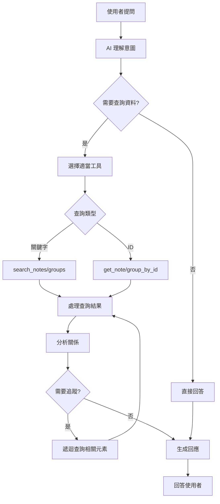

# AI Agent 對話功能設計文件 V2（簡化版）

## 概述
AI Agent 是整合在白板應用右側側邊欄的智能助手，能夠理解白板內容並協助使用者查詢和分析資料。

## 核心資料模型

### EnhancedStickyNote（增強型便利貼）
當 AI 查詢便利貼時，會返回包含完整關係資訊的物件：

```typescript
interface EnhancedStickyNote {
  // 基本資訊
  id: string;
  content: string;              // 便利貼內容
  color: string;                // 顏色
  position: { x: number; y: number };
  
  // 連接關係
  connections: {
    incoming: Array<{           // 傳入的連接（誰連到我）
      noteId: string;
      noteContent: string;      // 連接便利貼的內容摘要
    }>;
    outgoing: Array<{           // 傳出的連接（我連到誰）
      noteId: string;
      noteContent: string;
    }>;
  };
  
  // 群組資訊
  group?: {
    id: string;
    name: string;
  };
}
```

### EnhancedGroup（增強型群組）
當 AI 查詢群組時，會返回包含完整階層資訊的物件：

```typescript
interface EnhancedGroup {
  // 基本資訊
  id: string;
  name: string;
  color: string;
  
  // 包含的元素
  contains: {
    notes: Array<{              // 群組內的便利貼
      id: string;
      content: string;          // 便利貼內容摘要（前50字）
    }>;
    groups: Array<{             // 子群組
      id: string;
      name: string;
    }>;
  };
  
  // 父群組資訊
  parentGroup?: {
    id: string;
    name: string;
  };
  
  // 統計資訊
  stats: {
    totalNotes: number;         // 包含所有子群組的便利貼總數
    totalGroups: number;        // 子群組總數
    depth: number;              // 在群組樹中的深度
  };
}
```

## 查詢工具定義

### 1. search_notes（搜尋便利貼）
根據關鍵字搜尋便利貼內容。

```typescript
// 參數
interface SearchNotesParams {
  keywords: string[];           // 搜尋關鍵字（1-5個）
  matchType?: 'any' | 'all';   // 匹配模式：任一或全部（預設 'any'）
  inGroup?: string;             // 限定在特定群組內搜尋（選填）
}

// 回應
interface SearchNotesResponse {
  results: EnhancedStickyNote[];
  totalMatches: number;
  searchSummary: string;        // AI 生成的搜尋結果摘要
}
```

**使用範例**：
```typescript
// 搜尋包含「產品」或「規劃」的便利貼
search_notes({
  keywords: ['產品', '規劃'],
  matchType: 'any'
})

// 在特定群組內搜尋
search_notes({
  keywords: ['API'],
  inGroup: 'group_backend'
})
```

### 2. get_note_by_id（根據 ID 取得便利貼）
根據 ID 取得特定便利貼的詳細資訊。

```typescript
// 參數
interface GetNoteParams {
  noteId: string;
  includeConnections?: boolean;  // 是否包含連接資訊（預設 true）
  includeGroup?: boolean;        // 是否包含群組資訊（預設 true）
}

// 回應
interface GetNoteResponse {
  note: EnhancedStickyNote | null;
  error?: string;                // 找不到時的錯誤訊息
}
```

**使用範例**：
```typescript
// 取得完整的便利貼資訊
get_note_by_id({
  noteId: 'note_abc123'
})

// 只取得基本資訊
get_note_by_id({
  noteId: 'note_abc123',
  includeConnections: false,
  includeGroup: false
})
```

### 3. search_groups（搜尋群組）
根據關鍵字搜尋群組名稱。

```typescript
// 參數
interface SearchGroupsParams {
  keywords: string[];           // 搜尋關鍵字（1-5個）
  matchType?: 'any' | 'all';   // 匹配模式（預設 'any'）
  includeNested?: boolean;      // 是否搜尋巢狀群組（預設 true）
}

// 回應
interface SearchGroupsResponse {
  results: EnhancedGroup[];
  totalMatches: number;
  groupHierarchy: string;       // 群組階層的文字表示
}
```

**使用範例**：
```typescript
// 搜尋名稱包含「前端」的群組
search_groups({
  keywords: ['前端']
})

// 搜尋包含所有關鍵字的群組
search_groups({
  keywords: ['產品', '規劃'],
  matchType: 'all'
})
```

### 4. get_group_by_id（根據 ID 取得群組）
根據 ID 取得特定群組的詳細資訊。

```typescript
// 參數
interface GetGroupParams {
  groupId: string;
  includeContents?: boolean;    // 是否包含內容資訊（預設 true）
  includeParent?: boolean;      // 是否包含父群組資訊（預設 true）
  maxDepth?: number;            // 遞迴深度限制（預設 1）
}

// 回應
interface GetGroupResponse {
  group: EnhancedGroup | null;
  error?: string;
}
```

**使用範例**：
```typescript
// 取得完整的群組資訊
get_group_by_id({
  groupId: 'group_xyz789'
})

// 取得群組及其所有子群組（深度2層）
get_group_by_id({
  groupId: 'group_xyz789',
  maxDepth: 2
})
```

## 工具使用流程



## 實際使用範例

### 範例 1：尋找相關便利貼
```typescript
// 使用者：「找出所有關於 API 設計的便利貼」
const notes = await search_notes({
  keywords: ['API', '設計', '介面'],
  matchType: 'any'
});

// AI 回應：找到 5 個相關便利貼
notes.results.forEach(note => {
  console.log(`- ${note.content}`);
  if (note.connections.outgoing.length > 0) {
    console.log(`  連接到：${note.connections.outgoing.map(c => c.noteContent).join(', ')}`);
  }
});
```

### 範例 2：分析群組結構
```typescript
// 使用者：「後端開發群組包含哪些內容？」
const group = await get_group_by_id({
  groupId: 'group_backend',
  maxDepth: 2
});

if (group.group) {
  console.log(`群組：${group.group.name}`);
  console.log(`包含 ${group.group.stats.totalNotes} 個便利貼`);
  console.log(`子群組：`);
  group.group.contains.groups.forEach(g => {
    console.log(`  - ${g.name}`);
  });
}
```

### 範例 3：追蹤便利貼關係
```typescript
// 使用者：「這個需求會影響哪些功能？」
const note = await get_note_by_id({ noteId: 'note_requirement' });

if (note.note) {
  console.log(`需求：${note.note.content}`);
  console.log(`\n影響的功能：`);
  
  // 追蹤所有傳出連接
  for (const connection of note.note.connections.outgoing) {
    const relatedNote = await get_note_by_id({ noteId: connection.noteId });
    if (relatedNote.note) {
      console.log(`- ${relatedNote.note.content}`);
      // 可繼續遞迴追蹤
    }
  }
}
```

## 工具整合策略

### 智慧查詢組合
AI 可以組合多個工具來回答複雜問題：

1. **階層式查詢**：先搜尋群組，再查詢群組內的便利貼
2. **關係追蹤**：從一個便利貼開始，逐層追蹤相關內容
3. **交叉分析**：同時搜尋便利貼和群組，找出關聯性

### 效能優化
- 使用快取避免重複查詢
- 批量查詢相關元素
- 限制遞迴深度防止無限循環
- 優先返回最相關的結果

## 對話範例

### 對話 1：產品規劃查詢
```
使用者：幫我找出所有跟產品規劃相關的內容

AI：我來搜尋相關內容...
[執行 search_notes(['產品', '規劃'])]
[執行 search_groups(['產品', '規劃'])]

找到以下相關內容：

📝 便利貼（8個）：
1. "Q1 產品規劃會議" - 在「會議記錄」群組
   → 連接到：「行動項目」「待辦事項」
2. "產品路線圖" - 在「策略」群組
   → 連接到：「里程碑」「關鍵指標」
...

📁 群組（2個）：
1. 「產品策略」- 包含 15 個便利貼、3 個子群組
2. 「規劃文件」- 包含 8 個便利貼

需要我詳細說明某個部分嗎？
```

### 對話 2：關係分析
```
使用者：「用戶登入」這個功能會影響哪些其他功能？

AI：讓我追蹤「用戶登入」的相關連接...
[執行 search_notes(['用戶登入'])]
[執行 get_note_by_id('note_login')]
[遞迴執行多個 get_note_by_id]

「用戶登入」功能的影響分析：

直接影響（第一層）：
- 身份驗證系統
- 會話管理
- 權限控制

間接影響（第二層）：
- 個人資料頁面
- 訂單系統
- 支付流程
- 通知系統

這些功能都依賴於用戶登入功能的正常運作。
```

## 未來擴展

### 進階查詢功能
- 支援正則表達式搜尋
- 時間範圍篩選
- 多條件組合查詢
- 相似度搜尋

### 分析工具
- 關係圖譜生成
- 重要性評分
- 自動分類
- 趨勢分析

### 智能建議
- 基於查詢歷史的推薦
- 相關內容建議
- 結構優化建議
- 缺失內容提醒