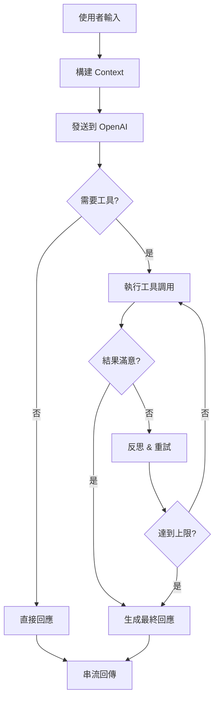
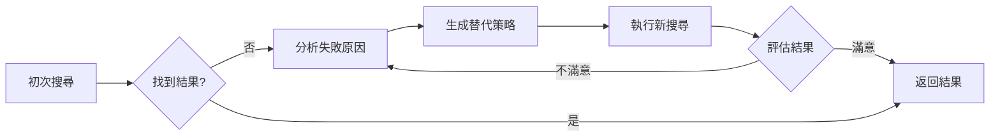

# AI Agent 系統設計文檔

## 目錄
1. [系統架構概覽](#系統架構概覽)
2. [核心流程設計](#核心流程設計)
3. [Context 管理策略](#context-管理策略)
4. [工具調用決策機制](#工具調用決策機制)
5. [反思與重試策略](#反思與重試策略)
6. [串流通訊設計](#串流通訊設計)
7. [目前問題與優化建議](#目前問題與優化建議)

## 系統架構概覽

### 整體架構圖
```
┌─────────────┐     ┌──────────────┐     ┌──────────────┐
│   前端 UI   │────▶│  API Routes  │────▶│  OpenAI API  │
│  (React)    │◀────│   (Next.js)  │◀────│  (GPT-3.5)   │
└─────────────┘     └──────────────┘     └──────────────┘
       │                    │                     │
       │                    │                     │
       ▼                    ▼                     ▼
┌─────────────┐     ┌──────────────┐     ┌──────────────┐
│  SSE Stream │     │ Tool Executor│     │Function Call │
│   Handler   │     │   (5 tools)  │     │   Handler    │
└─────────────┘     └──────────────┘     └──────────────┘
```

### 主要組件

1. **前端組件**
   - `AIChatPanelStream.tsx` - 聊天 UI 界面
   - `useAIAgentStream.ts` - React Hook 處理 SSE 串流

2. **API 路由**
   - `/api/ai-agent/route.ts` - 基礎非串流版本
   - `/api/ai-agent/stream/route.ts` - 單次工具調用串流版本
   - `/api/ai-agent/stream-multi/route.ts` - 連續工具調用版本

3. **工具定義**
   - `/api/ai-agent/tools.ts` - OpenAI Function Calling 工具定義

## 核心流程設計

### 完整對話流程



### 目前實作細節

```typescript
// stream-multi/route.ts 核心邏輯
const MAX_TOOL_CALLS = 5;

while (shouldContinue && toolCallCount < MAX_TOOL_CALLS) {
  // 1. 呼叫 OpenAI
  const completion = await openai.chat.completions.create({
    model: 'gpt-3.5-turbo',
    messages: allMessages,
    tools: aiAgentTools,
    tool_choice: 'auto',  // 讓 AI 自動決定
  });

  // 2. 處理工具調用
  if (responseMessage.tool_calls) {
    for (const toolCall of responseMessage.tool_calls) {
      // 執行並回傳結果
      const result = await executeToolCall(...);
      allMessages.push({
        role: 'tool',
        content: JSON.stringify(result),
        tool_call_id: toolCall.id
      });
    }
    continue; // 繼續循環
  } else {
    shouldContinue = false; // 結束循環
  }
}
```

## Context 管理策略

### 1. 初始 Context 構建

```typescript
// 目前實作
const generateWhiteboardContext = () => {
  return `
    白板內容摘要：
    - 便利貼數量：${notes.length}
    - 群組數量：${groups.length}
    - 主要群組：${topGroups}
    - 部分便利貼內容：${sampleNotes}
  `;
};
```

**問題：**
- Context 過於簡單，只有統計資訊
- 缺少語義理解和主題識別
- 沒有建立知識圖譜

### 2. 對話歷史管理

```typescript
// 目前實作
const conversationHistory = messages
  .slice(-(maxHistoryLength || 10))  // 只保留最近 10 條
  .filter(msg => msg.role !== 'tool'); // 過濾工具訊息
```

**問題：**
- 簡單的 FIFO 策略，可能丟失重要上下文
- 沒有考慮訊息重要性權重

## 工具調用決策機制

### 目前的工具定義

```typescript
// 5 個可用工具
1. search_notes - 搜尋便利貼
2. get_note_by_id - 獲取特定便利貼
3. search_groups - 搜尋群組
4. get_group_by_id - 獲取特定群組
5. get_whiteboard_overview - 獲取白板概覽
```

### 決策流程

目前完全依賴 OpenAI 的 `tool_choice: 'auto'`，由 GPT 自行決定。

**System Prompt 指引：**
```
1. 先理解意圖，再使用工具
2. 智慧搜尋與反思策略
3. 連續工具使用
4. 回答方式
```

**問題：**
- 缺少明確的工具選擇策略
- 沒有工具使用優先級
- 缺少工具組合策略

## 反思與重試策略

### 目前的反思機制

```typescript
// System Prompt 中的指引
如果第一次搜尋沒有找到結果，請反思並嘗試其他策略：
- 使用同義詞、相關詞、變體詞彙
- 例如：「付費方案」→「付費方式」「價格」「費用」
- 例如：「TA」→「目標客戶」「目標受眾」「客群」
- 至少嘗試 2-3 種不同的搜尋策略
```

**問題：**
- 反思策略寫在 Prompt 中，不夠結構化
- 缺少學習機制，無法記住成功的策略
- 沒有基於結果的動態調整

### 理想的反思流程



## 串流通訊設計

### SSE (Server-Sent Events) 事件類型

```typescript
// 目前定義的事件
type SSEEvent = 
  | { type: 'tool_call_start', tool: string, args: any }
  | { type: 'tool_call_result', tool: string, result: any }
  | { type: 'thinking', message: string }
  | { type: 'response_start' }
  | { type: 'response_chunk', content: string }
  | { type: 'done', totalToolCalls: number }
  | { type: 'error', error: string }
```

### 串流時序圖

```
Client          Server          OpenAI
  │               │               │
  ├──POST────────▶│               │
  │               ├──API Call────▶│
  │               │◀──Tool Calls──┤
  │◀──SSE:start───┤               │
  │◀──SSE:tool────┤               │
  │               ├──Execute─────▶│
  │◀──SSE:result──┤               │
  │               ├──API Call────▶│
  │               │◀──Response────┤
  │◀──SSE:chunk───┤               │
  │◀──SSE:done────┤               │
```

## 目前問題與優化建議

### 1. Context 優化

**問題：**
- 初始 context 太簡單
- 缺少智能摘要

**建議方案：**
```typescript
// 增強的 Context 生成
const generateEnhancedContext = () => {
  // 1. 主題識別
  const themes = identifyThemes(notes);
  
  // 2. 關鍵實體提取
  const entities = extractKeyEntities(notes);
  
  // 3. 關係圖譜
  const relationships = buildRelationshipMap(edges);
  
  // 4. 重要性排序
  const importantNotes = rankNotesByImportance(notes, edges);
  
  return {
    themes,
    entities,
    relationships,
    importantNotes,
    statistics: { /* 原有統計 */ }
  };
};
```

### 2. 工具選擇策略優化

**建議實作：**
```typescript
// 工具選擇策略
const toolSelectionStrategy = {
  // 優先級定義
  priority: {
    'get_whiteboard_overview': 1,  // 總覽優先
    'search_groups': 2,            // 群組次之
    'search_notes': 3,              // 便利貼再次
  },
  
  // 組合策略
  combinations: {
    'detailed_analysis': ['overview', 'groups', 'notes'],
    'specific_search': ['search', 'get_by_id'],
  }
};
```

### 3. 反思機制結構化

**建議實作：**
```typescript
interface ReflectionStrategy {
  failureReason: 'no_results' | 'partial_match' | 'ambiguous';
  alternatives: {
    synonymExpansion: string[];
    broaderSearch: string[];
    narrowerSearch: string[];
    relatedConcepts: string[];
  };
  confidence: number;
}

// 反思引擎
class ReflectionEngine {
  async reflect(query: string, result: any): Promise<ReflectionStrategy> {
    // 1. 分析失敗原因
    const reason = this.analyzeFailure(result);
    
    // 2. 生成替代策略
    const alternatives = await this.generateAlternatives(query, reason);
    
    // 3. 評估信心度
    const confidence = this.evaluateConfidence(alternatives);
    
    return { failureReason: reason, alternatives, confidence };
  }
}
```

### 4. 智能快取機制

**建議新增：**
```typescript
// 查詢快取
class QueryCache {
  private cache = new Map<string, CachedResult>();
  
  async get(query: string): Promise<CachedResult | null> {
    // 1. 精確匹配
    if (this.cache.has(query)) {
      return this.cache.get(query);
    }
    
    // 2. 語義相似度匹配
    const similar = this.findSimilarQueries(query);
    if (similar) {
      return this.cache.get(similar);
    }
    
    return null;
  }
}
```

### 5. 學習與改進機制

**建議新增：**
```typescript
// 成功策略記錄
interface SuccessfulStrategy {
  originalQuery: string;
  successfulKeywords: string[];
  toolsUsed: string[];
  timestamp: Date;
}

class LearningEngine {
  private strategies: SuccessfulStrategy[] = [];
  
  // 記錄成功策略
  recordSuccess(query: string, keywords: string[], tools: string[]) {
    this.strategies.push({
      originalQuery: query,
      successfulKeywords: keywords,
      toolsUsed: tools,
      timestamp: new Date()
    });
  }
  
  // 建議策略
  suggestStrategy(query: string): SuccessfulStrategy[] {
    return this.findSimilarStrategies(query);
  }
}
```

### 6. 更好的錯誤處理

**建議改進：**
```typescript
// 分層錯誤處理
enum ErrorLevel {
  RECOVERABLE,    // 可重試
  PARTIAL_FAILURE, // 部分失敗
  CRITICAL        // 嚴重錯誤
}

class ErrorHandler {
  async handle(error: Error, level: ErrorLevel) {
    switch(level) {
      case ErrorLevel.RECOVERABLE:
        return this.retry();
      case ErrorLevel.PARTIAL_FAILURE:
        return this.fallback();
      case ErrorLevel.CRITICAL:
        return this.gracefulFail();
    }
  }
}
```

## 立即可實施的優化

### 優先級 1（高影響，易實施）
1. **增強初始 Context**
   - 加入主題識別
   - 提取關鍵詞
   - 建立簡單的關係圖

2. **改進反思 Prompt**
   - 更結構化的指引
   - 明確的策略列表
   - 成功案例示範

### 優先級 2（中等影響）
1. **工具使用記錄**
   - 記錄成功的搜尋模式
   - 建立關鍵詞映射表

2. **快取機制**
   - 實作簡單的查詢快取
   - 避免重複搜尋

### 優先級 3（長期改進）
1. **語義理解增強**
   - 整合向量資料庫
   - 語義相似度搜尋

2. **學習機制**
   - 從使用者回饋學習
   - 動態調整策略

## 總結

目前的 AI Agent 系統已具備基本的工具調用和反思能力，但在以下方面仍有改進空間：

1. **Context 管理** - 需要更豐富的初始上下文
2. **反思策略** - 需要結構化和可學習的機制
3. **工具選擇** - 需要更智能的決策邏輯
4. **錯誤處理** - 需要分層的處理策略
5. **性能優化** - 需要快取和批處理機制

建議按優先級逐步實施改進，先從高影響且易實施的項目開始。